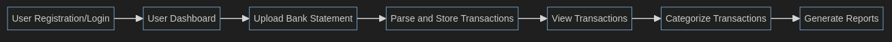

# Bank Statement Analyzer

### Project Description

In short we have 2 following options to implement the project:

Console Application

Welcome to Bank Statement Parser!

Please choose an option:
1. Register
2. Login
3. Exit

> 1
Enter your email: user@example.com
Enter your password: ********

Please choose an option:
1. Upload Bank Statement
2. View Transactions
3. Generate Report by grouped Transactions (by categories)
4. Logout

In this case we would want to implement sort of emailing system with SMTP server whihc will send the visualisation of expenses there

Detailed overview of each feature:

1. Upload Bank Statement

Step1: Upload Bank Statement
Step2: Parse data from the bank statement
Step3: Insert data into the DB

2. View Transactions

Step1: Insert filtration query (from, to)       # 2021 --> 2024
Step2: Get Data from the DB for that period
Step3: Display to the user in appropriate format (beautifully)

3. Generate Report by grouped Transactions (by categories)

Step1:  Insert filtration query (from, to)
Step2:  Get GROUPED Data from the DB for that period
Step3:  Display GROUPED dara with plots and figures
Step4:  Insert all plots into the pdf describing the whole report

### Flow of Bank Statement Analyzer




### Project Structure

```
bank_statement_parser/
├── src/
│   ├── __init__.py
│   ├── main.py
│   ├── parsers/
│   │   ├── __init__.py
│   │   ├── pdf_parser.py
│   │   ├── csv_parser.py
│   │   ├── xlsx_parser.py
│   ├── models/
│   │   ├── __init__.py
│   │   ├── transaction.py
│   ├── services/
│   │   ├── __init__.py
│   │   ├── storage_service.py
│   │   ├── database_service.py
│   │   ├── report_service.py
│   ├── utils/
│   │   ├── __init__.py
│   │   ├── file_utils.py
│   │   ├── data_validation.py
│   ├── cli.py
│   ├── config.py
├── tests/
│   ├── __init__.py
│   ├── test_main.py
│   ├── parsers/
│   │   ├── test_pdf_parser.py
│   │   ├── test_csv_parser.py
│   │   ├── test_xlsx_parser.py
│   ├── models/
│   │   ├── test_transaction.py
│   ├── services/
│   │   ├── test_storage_service.py
│   │   ├── test_database_service.py
│   │   ├── test_report_service.py
│   ├── utils/
│   │   ├── test_file_utils.py
│   │   ├── test_data_validation.py
├── .gitignore
├── .pre-commit-config.yaml
├── .github/
│   ├── workflows/
│   │   ├── ci.yml
├── Dockerfile
├── docker-compose.yml
├── requirements.txt
├── README.md
├── setup.py
├── LICENSE
```